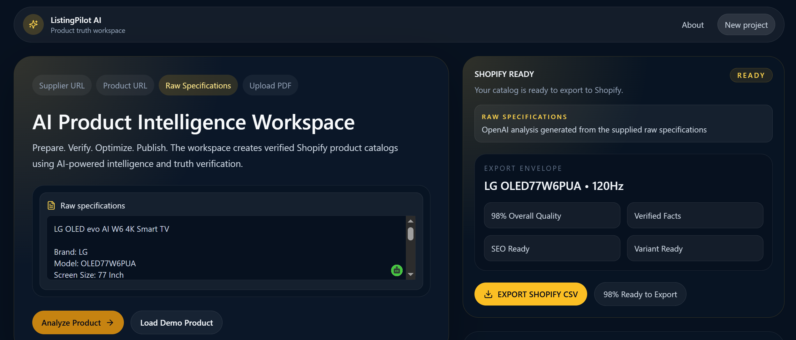
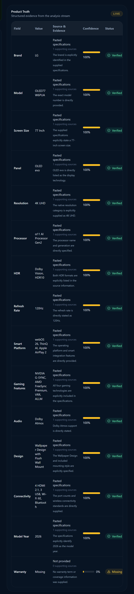
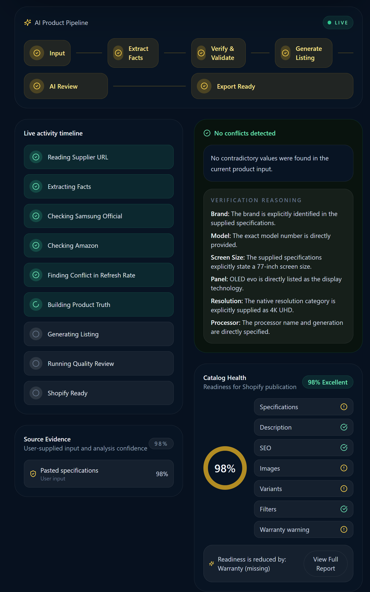
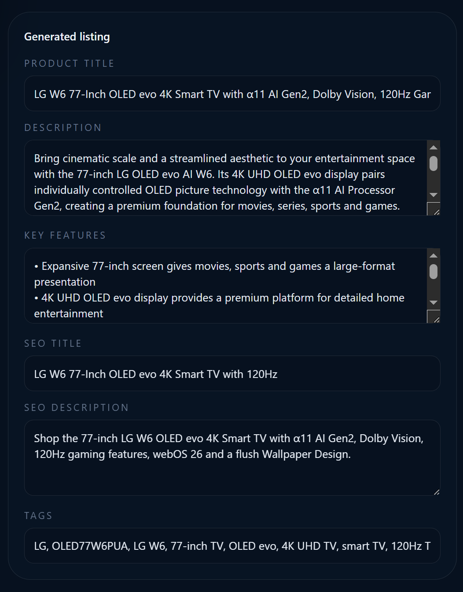

<div align="center">

# 🚀 ListingPilot AI

### AI Product Intelligence Workspace for Shopify Merchants

Transform raw product specifications into publication-ready Shopify listings with AI-powered verification, structured product intelligence, SEO generation, and one-click Shopify export.

<p align="center">

<a href="https://listingpilot-aymdovf3r-listing-pilot.vercel.app/">

</a>


</p>

**Built during OpenAI Build Week 2026**

</div>

---

# 📖 Overview

Creating product listings for an e-commerce store is repetitive, time-consuming, and prone to mistakes.

Merchants often copy supplier specifications into spreadsheets, manually verify product information, write SEO content, create product descriptions, and finally publish everything to Shopify.

ListingPilot AI transforms this workflow into a guided AI experience.

Instead of simply generating text, it first understands the product, evaluates available information, highlights missing details, explains its reasoning, and then produces publication-ready Shopify content.

## 📸 Dashboard Preview

ListingPilot AI transforms raw supplier specifications into verified, publication-ready Shopify listings through an AI-powered workflow.



# 🚨 The Problem

Every product listing requires merchants to:

- Read supplier specifications
- Extract important information
- Verify product details
- Write descriptions
- Optimize SEO
- Prepare Shopify fields
- Avoid publishing incorrect information

Repeating this process hundreds of times quickly becomes one of the biggest bottlenecks in e-commerce operations.

---

# 💡 The Solution

ListingPilot AI combines structured product understanding with AI-generated content.

Instead of asking AI to "write a description," ListingPilot follows an intelligent workflow:

```

Raw Specifications

↓

AI Analysis

↓

Product Truth Verification

↓

AI Detective

↓

Catalog Health

↓

Listing Generation

↓

Shopify Export

```

Every stage improves confidence before publication.

---

# ✨ Core Features
## 🤖 AI Product Analysis

The AI begins by analyzing raw product specifications instead of immediately generating marketing text.

It extracts structured information, identifies key product attributes, evaluates data completeness, and prepares the foundation for the rest of the workflow.

**Highlights**

- AI-powered specification analysis
- Structured product extraction
- Confidence scoring
- Missing information detection
- Intelligent product understanding

---

## ✅ Product Truth

Product Truth verifies every important product attribute before it reaches the final listing.

Each detected value includes:

- Verified value
- Confidence score
- Source evidence
- AI reasoning

Instead of asking users to blindly trust AI, ListingPilot explains **why** each piece of information can be trusted.

### Product Truth in Action

Every important product attribute is verified with supporting evidence and a confidence score before it is used in the final listing.



## 🕵️ AI Detective & Catalog Health

ListingPilot doesn't stop after extracting product information.

The AI explains **how it reached every important conclusion**, identifies unsupported or missing information, and evaluates the overall readiness of the product before publication.

### Key Capabilities

- AI verification reasoning
- Conflict detection
- Source confidence
- Product completeness analysis
- Shopify publication readiness



## 📊 Catalog Health

Before publication, ListingPilot evaluates the overall quality of the listing.

The Catalog Health score reviews areas such as:

- Product specifications
- Description quality
- SEO readiness
- Product completeness
- Publication readiness

Rather than simply generating content, ListingPilot helps improve content quality.

---

## ✍️ AI Listing Generator

After verification is complete, ListingPilot AI generates a complete Shopify-ready product listing.

The generated content includes:

- SEO-friendly product title
- Marketing description
- Key Features
- SEO Title
- SEO Description
- Search Tags

The output is editable, exportable, and designed to fit directly into a Shopify product workflow.

### Generated Shopify Content



## 📦 Shopify Export

After the listing has been reviewed, it can be exported as a Shopify-ready CSV.

This allows merchants to move directly from AI-generated content into their Shopify workflow with minimal manual formatting.

---

# 🏗 Workflow

```text
Raw Product Specifications
          │
          ▼
     AI Analysis
          │
          ▼
    Product Truth
          │
          ▼
     AI Detective
          │
          ▼
    Catalog Health
          │
          ▼
 AI Listing Generation
          │
          ▼
 Shopify CSV Export
```
---

# 🛠 Tech Stack

| Category | Technology |
|----------|------------|
| Frontend | Next.js 15 |
| Language | TypeScript |
| Styling | Tailwind CSS |
| AI | OpenAI Responses API |
| UI Components | React |
| Deployment | Vercel |
| Version Control | Git & GitHub |

---

# Local Development

PostgreSQL, Prisma, and Auth.js setup instructions are documented in [docs/authentication-setup.md](docs/authentication-setup.md).

---

# 🧠 Why ListingPilot AI?

Most AI listing tools focus on generating text.

ListingPilot AI focuses on **understanding the product first**.

Instead of immediately creating a description, it follows a structured verification workflow that helps merchants publish higher-quality listings with greater confidence.

### Traditional AI

- Generate text
- Hope it's correct
- Manually verify everything

### ListingPilot AI

- Analyze product data
- Verify important facts
- Explain AI reasoning
- Measure listing quality
- Generate publication-ready content
- Export for Shopify

This verification-first approach reduces manual work while giving merchants greater visibility into how the AI reached its conclusions.

---

# 🚀 Future Roadmap

The current Build Week version focuses on raw specification analysis.

Future versions will expand ListingPilot AI into a complete e-commerce product intelligence platform.

Planned features include:

- 🌐 Supplier URL analysis
- 📄 PDF specification parsing
- 🔍 Multi-source product verification
- 🛍 Direct Shopify publishing
- 🖼 AI lifestyle image generation
- 📦 Batch product processing
- 🧩 Browser extension
- 📊 Product comparison engine
- 🤖 AI merchandising assistant

---

# 👩‍💻 Built During OpenAI Build Week

ListingPilot AI was developed during **OpenAI Build Week 2026** as an exploration of how AI can improve one of the most repetitive workflows in e-commerce.

The project demonstrates how structured AI reasoning can be combined with content generation to help merchants publish products more accurately and efficiently.

---
## Tech Stack

- Next.js
- React
- TypeScript
- Tailwind CSS
- OpenAI
- Vercel

## Future Roadmap

- Multi-language support
- Shopify App integration
- Bulk catalog analysis
- AI image generation

---

# Built with OpenAI

ListingPilot AI was developed during **OpenAI Build Week 2026** using both **Codex** and **GPT-5.6** throughout the project.

### Codex
- Built and implemented application features
- Assisted with debugging and refactoring
- Accelerated frontend development
- Helped integrate and polish the application

### GPT-5.6
- Designed the overall product concept and workflow
- Refined the user experience and interface
- Helped design Product Truth, AI Detective, and Catalog Health
- Created product listing templates and prompts
- Assisted with documentation, README, and presentation

# 📄 License

This project is released under the MIT License.
